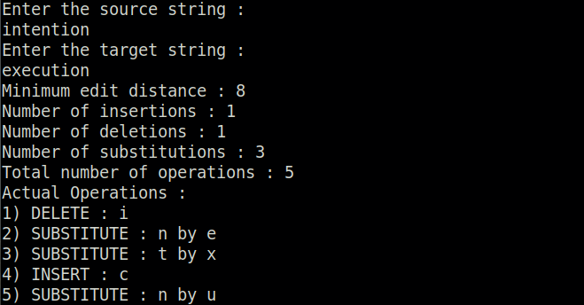
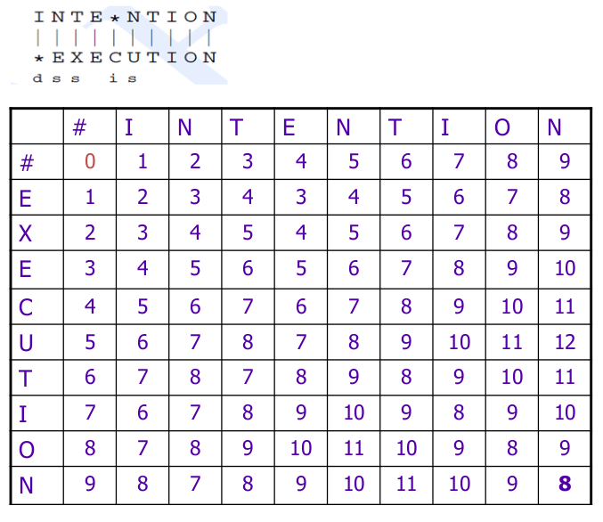

# Minimum Edit Distance

## Theory

[Wagner-Fischer algorithm](https://en.wikipedia.org/wiki/Wagner%E2%80%93Fischer_algorithm) is a non-probabilistic, dynamic programming algorithm that computes the edit distance (Levenshtein distance) between two strings. 

The edit distance between two strings gives the measure of how alike or similar two strings are to each other.
There are different types of edit distance depending upon the set of string operations allowed. For example, Levenshtein distance, Longest Common Subsequence (LCS) distance, Hamming distance, etc.
As the term Levenshtein distance is most common metric, it is often used interchangeably with edit distance.
For more information on Levenshtein distance, refer [wiki](https://en.wikipedia.org/wiki/Levenshtein_distance).

The minimum edit distance or the Levenshtein distance between two strings is the minimum number of editing operations (insertion, deletion, substitution) needed to transform one string into another.

The program `wagner_fischer.py` is the implementation of Wagner-Fischer algorithm. The cost of edit operations can be changed with default cost as: insertion - 1, deletion - 1, substitution - 2.

For more details of the algorithm, refer `algorithm_details.pdf`.

## Usage

>   python3 wagner_fischer.py

Example :

Edit Distance Table :

